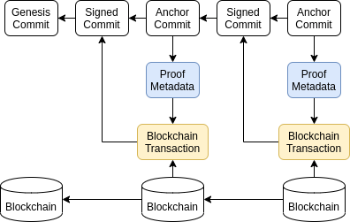
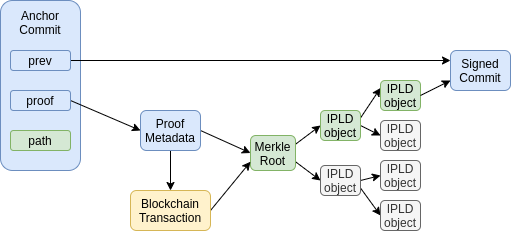

# Ceramic Protocol Specification
[](https://lbesson.mit-license.org/)
[](https://discord.gg/6VRZpGP)
[](https://twitter.com/ceramicnetwork)

This document contains the technical specification for the Ceramic protocol. For a higher-level introduction to the Ceramic network, see the [Ceramic Overview](https://github.com/ceramicnetwork/ceramic/blob/master/OVERVIEW.md).

## Index

- [Protocol overview](#protocol-overview)
- [Stream lifecycle](#stream-lifecycle)
  - [Creating a stream](#creating-a-stream)
  - [Updating a stream](#updating-a-stream)
  - [Looking up a stream](#looking-up-a-stream)
- [Stream Identifiers](#stream-identifiers)
- [Commit log](#commit-log)
  - [Blockchain anchoring](#blockchain-anchoring)
  - [Conflict resolution](#conflict-resolution)
  - [Stream commits](#stream-commits)
- [Stream types](#stream-types)
  - [Streamtypes in Ceramic](#streamtypes-in-ceramic)
  - [Update rules](#update-rules)
- [Stream update propagation](#stream-update-propagation)
  - [Queries](#queries)
  - [Future improvements](#future-improvements)
- [Implementations](#implementations)


## Protocol overview

Ceramic is a decentralized protocol that enables the creation of mutable, tamper-resistant data structures on a worldwide public network. Ceramic's programmable data streams are achieved through a combination of digital signatures, stream update rules, and blockchain anchoring. A Ceramic stream can be used to build up flexible data structures that can in turn be used to represent a wide variety of things such as self-sovereign identities, specific pieces of data or content, media files, schemas, policies for data access control, verifiable credentials, agreements between multiple parties, etc. The protocol doesn’t rely on any particular blockchain system, instead it utilizes [IPLD](https://ipld.io) to encode changes into a hash linked data structure, called a Merkle DAG ([Directed Acyclic Graph](https://en.wikipedia.org/wiki/Directed_acyclic_graph)), and anchors those updates into a blockchain which provides strict ordering to the updates to a given stream. Verifying the state of a particular stream only requires a user to sync the data of the given stream, and the user does not need to sync the state of the entire network as is the case with all blockchain networks that maintain a global state (i.e. Bitcoin, Ethereum). A node in the Ceramic network can thus choose to only *pin* the streams it cares about. This means that there is no global ledger of streams.

A Ceramic stream consists of an append-only log of commits where updates are signed by a decentralized identifier (DID), validated against a set of state transition rules, then anchored on a blockchain. *Streamtypes* specify the explicit rules that govern what constitutes a valid update (state transition) to the stream. This architecture allows Ceramic nodes to manage and verify the state of a given stream in a decentralized way without centralized servers or middlemen. When a valid update is made to a particular stream, the node then gossips the update to the rest of the network and any nodes interested in this stream will update the state of the given stream on their node. As a result, any node can receive a query for a stream and return the correct state even if it does not maintain the state of the stream itself. As long as at least one node on the network continues to maintain state for a given stream, that stream remains available to *any* node on the network.

## Stream lifecycle

Every stream in the Ceramic network is self-contained and the lifecycle of all streams can be broadly described in the same way. There are three main actions that can happen to a stream: *create*, *update*, and *lookup*.



### Creating a stream

When creating a stream an IPLD object that contains the initial content of the stream is created. This is called the [genesis commit](#genesis-commit), and its [CID](https://github.com/multiformats/cid) is used (along with the streamtype) to generate the stream identifier (StreamID). Depending on the stream type there might be constraints about what is considered valid content for the genesis commit.

### Updating a stream

In order to update a stream two commits need to be added. These updates are added to the [commit log](#commit-log), which is a linked list of commits. First a [signed commit](#signed-commits) that contains an update to the content is created and added to the log. After the signed commit has been created the [CID](https://github.com/multiformats/cid) of this commit is sent to an anchoring service that batches a set of stream updates into a merkle tree and submits the root hash to a blockchain for finalization. The anchoring service then returns an [anchor commit](#anchor-commits) for the given CID which is added to the commit log. A complete update to the stream has now been made. After each new commit is added to the stream's commit log the node publishes an update message containing the *StreamID* and the CID of the new commit to the [ceramic pubsub topic](#stream-update-propagation).

### Looking up a stream

To look up a stream, the *StreamID* is needed. Once a *StreamID* is known a node can look up a stream by sending a lookup request to the [ceramic pubsub topic](#stream-update-propagation). Other nodes that have the state of this stream will respond with the latest commit CID that they know of. The node making the lookup now resolves the commit log of all of the CIDs that it receives (in most cases this will only be one CID). If there are any conflicts they will be resolved by the [conflict resolution mechanism](#conflict-resolution). Once any conflicts are resolved all the updates from the signed commits are applied to the genesis commit and the latest state of the stream is found.

## Stream Identifiers

In Ceramic, each stream has a unique identifier (StreamID). This is a persistent identifier of the stream that never changes. The identifier encoding is defined in [**CIP-59**](https://github.com/ceramicnetwork/CIP/issues/59). When encoded as a string, a StreamID is often prepended with the protocol handler:

```
ceramic://<StreamID>
```

As an example, a StreamID might look like this:

```
ceramic://kjzl6fddub9hxf2q312a5qjt9ra3oyzb7lthsrtwhne0wu54iuvj852bw9wxfvs
```

### Stream versions

Each commit to a stream's commit log represents a unique version of that stream. Each commit in a stream's history can be referred to directly by it's CommitID. CommitIDs use the format defined in [**CIP-59**](https://github.com/ceramicnetwork/CIP/blob/main/CIPs/CIP-59/CIP-59.md#commitid).


## Commit log

A Ceramic stream is made up of an append-only log of commits that can be reduced to a single data structure based on the rules of the specified StreamType. Each commit in the log is an [IPLD](https://ipld.io) object that can be referenced by its [CID](https://github.com/multiformats/cid). Since CIDs are unique identifiers, based on the contents of the object we can create a linked list where each commit contains a `prev` pointer to the previous entry in the log. This makes the log an immutable history of commits. There might however be different branches of a log. To deal with this, a [conflict resolution](#conflict-resolution) strategy that uses blockchain anchoring is used. Each commit in the log is of a certain type: genesis, signed, or anchor. The genesis commit is the first commit of a stream. Signed commits contain an update to the stream. Anchor commits anchor a stream update to a blockchain. The structure of these commits is described in the [Stream commits](#stream-commits) section below.

### Blockchain anchoring

Stream updates are anchored to a blockchain using a merkle tree which is encoded using IPLD. The root of this merkle tree is put on a blockchain, and each leaf of the tree contains the hash of a stream update. This means that a large set of stream updates from across many different streams can be anchored to a blockchain using only one transaction. Since the merkle tree is encoded using IPLD, the witness (merkle proof) for a specific stream update can be synced efficiently over the IPFS network. In most cases this anchoring service will be run by a third party that aggregates many stream updates from many users, but a user may of course choose to anchor their own commits if they prefer. In the case of a user directly anchoring their own updates, they might not use a merkle tree.

In many cases individual users are likely to update a small number of streams. Instead of having to send their own blockchain transactions they can send their stream updates to an anchoring service. This service receives anchor requests from multiple different users and batches these requests into a single transaction on a regular interval. This service can be run by anyone, and it's possible to configure which anchoring service to use in a ceramic node. Different services might offer custom anchor intervals, or anchor to different blockchains. Depending on the context and use case of a given stream, one blockchain might be preferred to another. Currently, however, the protocol only supports anchoring on the Ethereum blockchain.

### Conflict resolution

If there are two different branches for a specific stream's commit log, the canonical branch is determined by looking at the conflicting anchor commits to determine which update happened first. When both anchors are on the same blockchain, the blockheight of the anchor is used; if the anchors are on different blockchains, the block timestamp is used.

It is important to note that an update might have an earlier anchor commit but not follow the [update rules](#update-rules) for the given streamtype. Therefore conflict resolution is applied after the update rules have been correctly applied. Since most streamtypes requires signed updates, a malicious actor would need to get access to the private key(s) of the stream creator in order to even create a valid conflicting branch.

#### Data withholding attacks

One suggested attack on this conflict resolution system is a data withholding attack. In this scenario a user creates a stream, makes two conflicting updates and anchors one of them earlier than the other, but only publishes the data of the update that was anchored later. Now subsequent updates to the stream will be made on top of the second, published update. Every observer will accept these updates as valid since they have not seen the first update. However if the user later publishes the data of the earlier update, the stream will fork back to this update and all of the other updates made to the stream will be invalidated.

This is essentially a *double spend attack* which is the problem that blockchains solve. However since identities have only one owner, the user, this is less of a problem. In this case, a "double spend" would cause the user to lose all history and associations that have accrued on their identity, which they are naturally disincentivized to do.

In the case of organizational identities this is more of a problem, e.g. if an old admin of the org wants to cause trouble. This can be solved by introducing "heavy anchors" which rely more heavily on some on-chain mechanism. For example, a smart contract or a DAO that controls the identity.

#### Two anchors, same blockheight

It is technically possible, though unlikely, that two conflicting updates to the same stream get anchored with the same blockheight. If this happens the protocol chooses the update with more updates that have been built on top of it (longest chain wins). If there is still a tie, then the protocol chooses the update commit which has the smallest CID in binary format (an arbitrary but deterministic choice).

### Stream commits

Commits act as the fundamental building block for Ceramic streams. A commit is an IPLD object that contains some data and a proof for that data. Each commit type provides a method for verifying its proofs. A proof can have many forms but the most common examples are signatures and blockchain anchors. Below the most common commit types are defined with the expected data format described using [IPLD Schema](https://specs.ipld.io/schemas/).

#### Genesis commit

The genesis commit is the first commit of the stream. The CID of this commit is used to create the persistent `StreamID` of the stream, which is an immutable permalink used to identify the particular stream. The schema outlined below describes the general form of genesis commits for any streamtype. It has two main properties: `header`, and `data`. The *data* property contains the content of the stream at the time of creation. The *header* property includes additional metadata about the stream.

```ipldsch
type GenesisHeader struct {
  controllers [String]
  schema optional String
  family optional String
  tags optional [String]
  unique optional String
}

type GenesisCommit struct {
  header GenesisHeader
  data Any
}
```

The following required properties need to be defined by all streamtypes.  However it's up to the specific streamtype how to use the data within.

- `controllers` - an array of DID strings that defines the controllers of the stream (i.e. who is allowed to make updates to it).
- `data` - the data that is used to generate the content of this stream

There are a few optional properties above that have special uses in the Ceramic protocol.

- `schema` - a string that should represent a Ceramic CommitID for a stream which contains a schema. It's up to the specific streamtype to use the schema to validate the stream content
- `family` - a string that can be used to categorize the given stream. Indexing services in the ceramic network will use this property if present
- `tags` - an array of strings that can be used to categorize the given stream. Indexing services in the Ceramic network will use this property if present
- `unique` - if present should contain a random string that allows the stream to get a unique StreamID even if it otherwise has the exact same content as another stream

#### Signed commits

A **signed commit** allows a stream to be updated. It either contains a signed proof (e.g. `address-link`) or is wrapped in one (e.g. streamtypes using [dag-jose](https://github.com/oed/js-dag-jose)). Signed commits contain a pointer to the previous commit as `prev`, an update to the stream as `data`, and the encoded signature. The way in which signatures are verified depend on which streamtype is being used.

```ipldsch
type SignedHeader struct {
  controllers optional [String]
  schema optional String
  family optional String
  tags optional [String]
}

type SignedCommit struct {
  id Link
  prev Link
  header optional SignedHeader
  data Any
}
```

The required properties that need to be defined by all signed commits:

- `id` - an IPLD link to the Genesis commit
- `prev` - an IPLD link to the previous commit
- `data` - the data that is used to update the content of the stream, e.g. a patch object

The three optional properties in the header serve specific purposes:

- `controllers` - should be included to update the controllers of the stream, e.g. key rotation
- `schema` - should be included to update the schema that is used by the stream
- `family` - should be included to update the family for the stream
- `tags` - should be included to update the tags for the stream

#### Anchor commits

An anchor commit is simply a proof that the CID of the `prev` property was anchored on a blockchain. The format of this commit can be seen below. The `proof` property contains the CID of the AnchorProof. This proof metadata object is shared by all stream updates that were anchored in the same merkle tree on the same blockchain. The `path` is the unique path to the leaf of the merkle tree that contains the CID that is also in the `prev` property.

##### Anchor commit:

```ipldsch
type MerkleNode struct {
  L Link
  R Link
}

type AnchorProof struct {
  chainId String
  blockNumber Int
  blockTimestamp Int
  txHash Link
  root Link
}

type AnchorCommit struct {
  id Link
  prev Link
  proof &AnchorProof
  path String
}
```

In addition to `id` and `prev` which where defined above, we have the following properties:

- `chainId` - a [CAIP-2](https://github.com/ChainAgnostic/CAIPs/blob/master/CAIPs/caip-2.md) string representing a specific blockchain
- `blockNumber` - the number of the block in which the transaction was included
- `blockTimestamp` - the timestamp in the block in which the transaction was included
- `txHash` - a CID of a blockchain transaction, e.g. [eth-tx](https://github.com/ipld/js-ipld-ethereum/)
- `root` - an IPLD link to a MerkleNode
- `path` - a string representing the path from `root` to the SignedCommit also referenced by `prev`

Note that the `blockNumber` and `blockTimestamp` are added to this object for convenience, but these numbers need to be verified. The `txHash` contains the CID of the blockchain transaction in which the root CID was included. Using this tx hash an external blockchain api can be used to validate the information of the proof. Finally the `root` property contains the CID of the root of the IPLD merkle tree.

Below a graphical representation of an Anchor Commit as well as its path in the merkle tree that contains its proof is depicted. Both the *Merkle Root* and *IPLD object* are represented by a *MerkleNode* as defined above.



To verify a specific anchor commit, use the following algorithm:

1. Get the proof metadata object from ipfs using the proof CID
2. Get all the data starting from `root` and follow all links in the `path`
3. Verify that the end of the path is the same as `prev`
4. Get the transaction data from the given blockchain using `txHash`
5. Verify that `blockNumber` and `blockTimestamp` are correct

A nice property of storing the anchor proof and the merkle tree using IPLD is that streams that share the same proof object and have similar paths in the merkle tree will end up collaboratively storing parts of the data of their proofs.

#### Additional commit types

In the future there might be new commit types defined by additional [CIPs](https://github.com/ceramicnetwork/CIP). These may include things like DAO commits which in theory could act as both an anchor and a signature commit. If a new commit type is defined, it needs to get explicit support in each streamtype.

## Stream types

Every Ceramic stream has to specify a stream type (streamtype). The streamtype describes the state transition rules that are applied to the update function of a stream and the format of the data in the stream.

### Streamtypes in Ceramic

There are currently two main streamtypes specified by Ceramic, but more can be added in the future if needed.

- [TileDocument](https://github.com/ceramicnetwork/CIP/issues/56) - General purpose documents used for identifiers, content, media, schemas, metadata, access control, etc.
- [CAIP10Link](https://github.com/ceramicnetwork/CIP/issues/15) - Links from blockchain addresses to DIDs

### Update rules

Each streamtype needs to specify rules for what constitutes valid updates/state transitions and valid sequences of log commits. The streamtype may also specify the required data format for the content of the given stream. For example, the *CAIP-10 link* streamtype only allows one DID as its content.

## Stream update propagation

Given a *StreamID*, the full log can be retrieved by communicating with other nodes in the ceramic network. This is achieved using [libp2p pubsub](https://github.com/libp2p/specs/tree/master/pubsub) to share the updates to a stream's commit log among peers. All nodes in the Ceramic network join the `/ceramic` pubsub topic. When a node makes a change to a stream, the new tip (most recent commit CID) is shared over the pubsub topic along with the StreamID. Peers that are interested in this stream see this message, fetch the new commits using IPFS and apply the log to the stream. If a node gets two or more conflicting tips the [conflict resolution mechanism](#conflict-resolution) is used.

**Update message format:**

```js
{
  typ: 0,
  stream: <StreamID>,
  tip: <tip-CID>
}
```

### Queries

A node can query other nodes for the latest tip of a particular stream. To do this they send a `QUERY` message to the pubsub topic. Other peers that see this message will respond with a `RESPONSE` message. More details are available in the [MultiQueries CIP](https://github.com/ceramicnetwork/CIP/blob/main/CIPs/CIP-71/CIP-71.md)

**Request message format:**

```js
{
  typ: 1,
  stream: StreamID,
  id: <unique query identifier>
}
```

If a node that has been offline comes back online it will have to make a request for all the streams it's interested in to make sure it has all the latest updates.

**Response message format:**

```js
{
  typ: 2,
  id: <ID of the query being resonded to>,
  tips: <map of StreamIDs to tip CIDs>
}
```


### Anchor metadata messages

When a node requests an anchor from an anchor service it will recieve metadata about when the service intends to anchor the stream update on a blockchain. However, other nodes interested in the same stream will be unaware of this extra metadata information. In order to share this info with other nodes, an `ANCHOR_META` message could be used to tell other nodes that a request has been made to a specific anchor service. The interested peers can then query the given anchor service to retrieve the metadata information. This functionality does not exist currently but is a likely future enhancement to the protocol.

### Message types

| name        | typ  | params                                                       |
| ----------- | ---- | ------------------------------------------------------------ |
| UPDATE      | 0    | stream: `StreamID`, tip: `tip-CID`                           |
| QUERY       | 1    | stream: `StreamID`, id: `query ID`                           |
| RESPONSE    | 2    | id: `query ID`, tips: `map of StreamIDs to tip-CIDs`         |


### Future improvements

The main reason for having one pubsub topic that all streams are shared within is to more easily create a well connected network. The benefit of this is that you can get updates from nodes interested in the same stream, even if not directly connected to them. The main drawback of this approach is scalability. Once the network grows the amount of streams and messages in the pubsub topic will be too large for many nodes. In order to deal with this the streams can be split into multiple different rooms using some form of namespace-ing. Exactly how this looks like is not yet determined.

A potential problem with the pubsub approach is some form of DoS. When a node makes a request for a specific stream a malicious actor could send a lot of tips that do not correspond to the requested stream. This would result in the requesting node having to do a lot of computation to make sure all of the received tips are in fact not correct. There are a few different way to solve this. One is to use a tit-for-tat system where nodes disconnect from nodes that send many incorrect responses. If many users do this it should effectively block malicious nodes as they start performing an attack. A different approach is to include a zero-knowledge proof in the response that proves that the CID in the message indeed does correspond to the correct stream.

## Implementations

Currently there is a Typescript ([js-ceramic](https://github.com/ceramicnetwork/js-ceramic)) implementation available. If you're interested in contributing an implementation in another language [please reach out](mailto:core@ceramic.network) and we'll help you get started!

### [Ceramic JavaScript Client](https://github.com/ceramicnetwork/js-ceramic)
