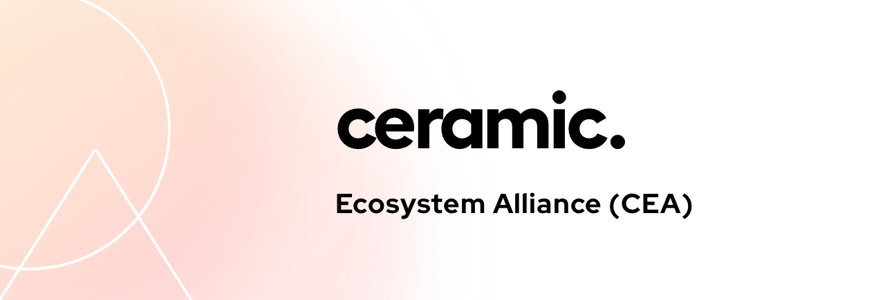

# Ceramic Ecosystem Alliance (CEA)

> The CEA is a grassroots network of projects and individuals collaborating on standards and use cases for the Ceramic Network.

- [Purpose](#purpose)
- [Structure](#structure)
- [Meetings](#meetings)
- [Working Groups](#working-groups)
- [Members](#members)
- [Join](#join-the-cea)

## Purpose

The CEA ***is*** a grassroots network of Ceramic collaborators. It was created as a way for community members to collaboratively discuss important topics related to Ceramic (such as governance, standards, use cases) in a self-organized way. To join, [follow these steps](#join-the-cea).

The CEA ***is not*** a replacement for [Ceramic Core Calls]() (Core Community Calls and Core Devs Calls), where the broader community generally convenes to learn more about Ceramic and discuss network upgrades. ([Click here]() to add Ceramic Core Calls to your calendar.) Rather, the CEA serves as a focused vehicle for interested parties to zoom in on important issues, organize into topic-based working groups, and share outcomes amongst the group.

## Structure

The CEA has three levels of organiztional structure:

`Members`: All participants.

`Working Groups`: Collections of members tackling specific areas of interest, such as Ceramic governance or identity.

`Stewards`: CEA members in charge of running CEA meetings and ensuring integrity of process.

## Meetings

### CEA Meetings

The entire CEA gathers every two weeks for a meeting (attendance is optional). In this meeting, members:

- Share progress from existing working groups
- Propose the creation of new working groups
- Evaluate new member applicants

> Since CEA meetings are primarily built around sharing progress from working groups, at least 1 member from each active working group is expected to attend.

### Working Group Meetings

CEA members self-organize into topic-based initiatives, called working groups. Individual working groups decide their own meeting schedule. Typically, working groups meet every two weeks so they have something to share out at the next bi-weekly CEA meeting. Notes from working group meetings are helpful to keep the rest of the CEA aligned.

## Working Groups

### Active

`Ceramic Governance`:

`Identity`:

`Interoperable Data`:

`Multi-Chain`:

`Services`:

### Closed

Nothing closed yet.

## Members

Below, find a list of all members and their participation in active working groups

| Members                           | Ceramic Governance        | Identity          | Interoperable Data      | Multi-Chain       | Services |
| :-------------                    | :-----------      | :-----------      | :-----------      | :-----------      | :--- |
| [3Box](http://3box.io)            | ✅                 | ✅                | ✅                | ✅                 | ✅ |
| [Textile](http://textile.io)      | ✅                 | ✅                | ✅                | ✅                 | ✅ |
| [IPFS](http://ipfs.io)            | ✅                 | ✅                | ✅                | ✅                 | ✅ |
| Sia           | ✅                 | ✅                | ✅                | ✅                 | ✅ |
| Storj           | ✅                 | ✅                | ✅                | ✅                 | ✅ |
| Dappkit           | ✅                 | ✅                | ✅                | ✅                 | ✅ |
| OrbitDB           | ✅                 | ✅                | ✅                | ✅                 | ✅ |
| [Aragon](http://aragon.org)            | ✅                 | ✅                | ✅                | ✅                 | ✅ |    
| [Gitcoin](http://gitcoin.com)     | ✅                 | ✅                | ✅                | ✅                 | ✅ |    
| [MetaMask](http://metamask.io)    | ✅                 | ✅                | ✅                | ✅                 | ✅ |
| [Magic](http://magic.link)        | ✅                 | ✅                | ✅                | ✅                 |  ✅ |   
| Temporal/RTrade  | ✅              | ✅                | ✅                | ✅                 |  ✅ |   
| [Infura](http://infura.io)        | ✅                 | ✅                | ✅                | ✅                 | ✅ |   
| [Anytype](http://anytype.io)      | ✅                 | ✅                | ✅                | ✅                 | ✅ |    
| [Colony](http://colony.io)        | ✅                 | ✅                | ✅                | ✅                 | ✅ |
| [DuckDuckGo](http://duck.com)     | ✅                 | ✅                | ✅                | ✅                 | ✅ |
| [Flow](http://withflow.com)       | ✅                 | ✅                | ✅                | ✅                 | ✅ |
| [Arweave](http://arweave.org)     | ✅                 | ✅                | ✅                | ✅                 | ✅ |
| [The Graph](http://thegraph.com)  | ✅                 | ✅                | ✅                | ✅                 | ✅ |
| [RabbitHole](http://rabbithole.io) | ✅                 | ✅                | ✅                | ✅                 | ✅ |
| [BrightID](http://brightid.org)     | ✅                 | ✅                | ✅                | ✅                 | ✅ |
| [Passbase](http://passbase.io)     | ✅                 | ✅                | ✅                | ✅                 | ✅ |
| [Akasha](http://akasha.org)       | ✅                 | ✅                | ✅                | ✅                 | ✅ |
| [Lunie](http://lunie.io)       | ✅                 | ✅                | ✅                | ✅                 | ✅ |
| [Rainbow](http://rainbow.org)       | ✅                 | ✅                | ✅                | ✅                 | ✅ |    
| [Alchemy](http://alchemy.io)       | ✅  | ✅  | ✅  | ✅  | ✅  |
| [MetaCartel](http://metacartel.org)       | ✅                 | ✅                | ✅                | ✅                 |  ✅ |
| [SimpleID](http://simpleid.io)       | ✅                 | ✅                | ✅                | ✅                 |  ✅ |

## Stewards

- Michael Sena (@michaelsena)
- Joel Torstensson (@oed)
- Danny Zuckerman (@dazuck)

## Join the CEA

1. Submit a Pull Request to this repository adding yourself to the members table above.

2. Fill out [this form](https://danny765911.typeform.com/to/AAFtVN). 

Once a steward has confirmed you have completed the previous two steps, they will put your membership application up for vote at the next CEA meeting. If a majority vote is reached (by members in attendance), a steward will merge your PR and send you a welcome email containing your invitation to the CEA Call Calendar and Discord.
